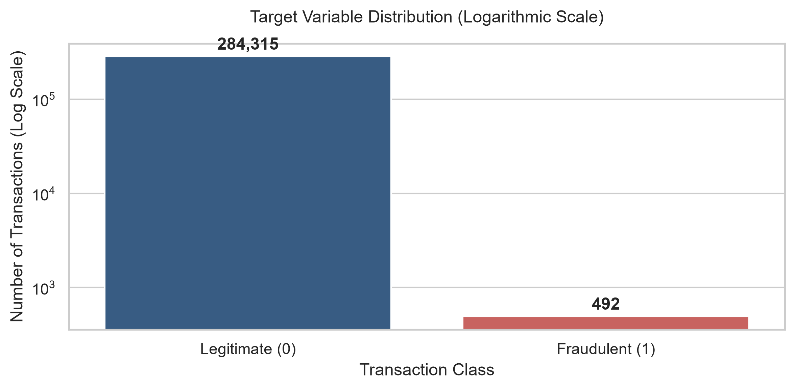
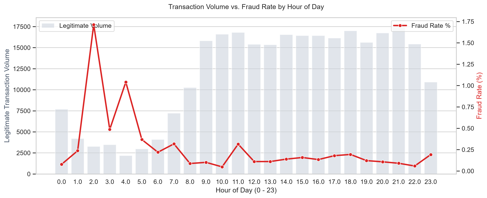
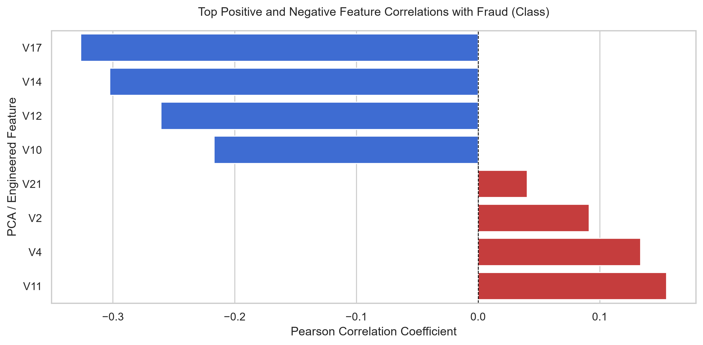

Table of Contents
    Executive Summary
    ETL Pipeline
    Exploratory Data Analysis

## Executive Summary
As a Data Scientist working at one of the largest banks in the UK, the effects of fraud on the institution and on customers are all too apparent. Whilst there are many rules-based fraud detection systems utilised by the bank, the high false positive rates and inability to dynamically adapt to trends can lead to friction with genuine everyday customers. Using a dataset of anonymised credit card transactions, this project addresses the challenge of creating a model which can detect and predict fraud in an extremely imbalanced dataset where fraud only accounts for 0.172% of total volume (492/284,807). The main goal is to maximise fraud capture (Recall) whilst strictly limiting false positives to preserve systems integrity, operational efficiency and customer trust.
This project implements an end-to-end data science pipeline built to demonstrate production-grade data engineering, machine learning, and interactive visualization practices:
•	Data Infrastructure & Engineering: Designed an automated ETL1 pipeline using Python (Pandas2, NumPy3, SQLAlchemy4) that ingests raw transaction feeds, applies robust scaling4 to temporal and monetary features, and handles severe class imbalance using SMOTE5 (Synthetic Minority Over-sampling Technique) combined with Tomek Links6.
•	Analytical Techniques & Modelling: Trained and evaluated multiple anomaly detection and supervised learning models (Logistic Regression, Random Forest, and XGBoost)7. Optimized thresholds using Precision-Recall (PR-AUC)8 curves rather than standard ROC-AUC9 to account for skewness.
•	Visualization & Reporting: Developed an interactive dashboard (Streamlit / Power BI) displaying key operational KPIs, real-time transaction scoring simulations, and SHAP (SHapley Additive exPlanations) visual insights for model explainability.

## ETL Pipline:
1.	Robust Scaling (Amount & Time)
Financial transaction amounts are heavily skewed (most purchases are small, but a few are thousands of dollars). Standard scaling methods fail here because extreme outliers pull the mean and variance.
•	Method used: RobustScaler from scikit-learn.
•	How it works: Instead of using the mean and standard deviation, it subtracts the median and divides by the Interquartile Range (IQR) (the spread between the 25th and 75th percentiles).
•	New columns created: scaled_amount and scaled_time.
2. Feature Engineering: Cyclic Time Transformation
The raw dataset stores time as continuous seconds elapsed since the first transaction over a 48-hour period. Machine learning models cannot easily recognize daily recurring fraud patterns from raw seconds.
Calculation: (Time // 3600) % 24
How it works: Converts raw seconds into an integer representing the hour of the day (0 through 23).
New column created: hour_of_day.
Why it matters: Fraud rates spike at specific times of day (e.g., late-night transactions when cardholders are asleep). This feature explicitly gives models time-of-day context.
3. Redundancy Cleanup & Column Dropping
To avoid feature redundancy and keep the dataset lean:
Action: Drops the original unscaled Amount and Time columns.
Result: Replaces raw values with scaled_amount, scaled_time, and hour_of_day, while preserving the anonymized PCA features (V1 through V28) and target variable (Class).

Before vs. After Transformation

Feature	Raw Data (creditcard.csv)	Transformed Data (creditcard_clean.parquet)
Transaction Amount	Amount (€0.00 to €25,691.16)	scaled_amount (Outlier-resistant zero-centered range)
Transaction Time	Time (0 to 172,792 seconds)	scaled_time (Scaled) + hour_of_day (0–23 hour integers)
Anonymized V-Features	V1 to V28	V1 to V28 (Preserved intact)
Fraud Label	Class (0 = Legitimate, 1 = Fraud)	Class (Preserved intact)

## 📊 Exploratory Data Analytics & Domain Insights > 🔗 **Deep Dive:** View the complete, fully documented [Exploratory Data Analysis Notebook](notebooks/01_eda_and_analytics.ipynb) containing step-by-step statistical calculations and visualisations.

All exploratory data analysis was conducted on the transformed data extracted directly from the SQLite Data Warehouse (`data/processed/fraud_warehouse.db`). Transaction amounts are originally denominated in **Euros (€)**.

---

### 1. Extreme Class Imbalance Analysis

* **Key Finding:** The dataset exhibits extreme class imbalance: **99.83% Legitimate** (€284,315 transactions) vs. **0.17% Fraudulent** (€492 transactions).
* **Analytical Impact:** Standard evaluation metrics like accuracy are misleading (a dummy model predicting 'Legitimate' achieves 99.83% accuracy). Downstream models must be evaluated using **Precision-Recall AUC (PR-AUC)** and **F1-Score**.

---

### 2. Temporal Behavior & Hourly Spikes

* **Key Finding:** While overall legitimate transaction volume drops significantly during off-peak hours (2:00 AM – 5:00 AM), the **relative fraud rate (%) spikes drastically**.
* **Business Takeaway:** Fraudulent actors exploit off-peak hours when victims are asleep and unlikely to notice real-time push notifications or block compromised cards.

---

### 3. Key Predictive Feature Drivers

* **Key Finding:** Anonymized PCA features **`V17`**, **`V14`**, **`V12`**, and **`V10`** show strong negative correlations with fraud, while **`V4`** and **`V11`** show strong positive correlations.
* **Engineering Impact:** These features provide clear signal-to-noise ratios and serve as top candidate features for classifier training.